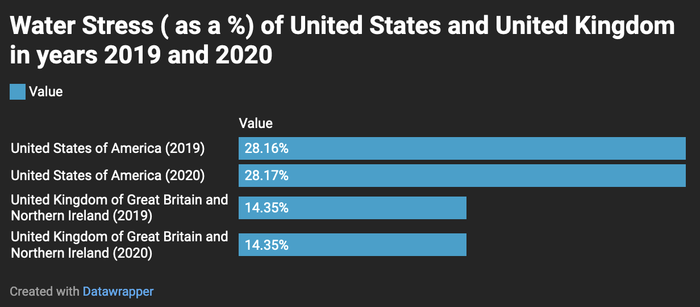

# WaterUsageUSA
A repository of water usage in the U.S. based on data gathered from *AquaStat* a global database created by the [*Food and Agriculture Organization of the United Nations*](https://www.fao.org/aquastat/en/)

# What we provide
We provide water usage data of the U.S. for years 2019 and 2020. Our repository becomes especially useful for viewing data of the U.S. from the *Aquastat* database, as the *Aquastat* database is hard to decifer for the average user. We provide information on the following variables: water stress, freshwater withdrawal, and water use effiency. Water stress (%) is shown below in comparison with the United Kingdom, a similar country (when comparing GDP and other factors).

# What is in here

##### 1. `Aquastat.csv` - the original dataset used. (WaterUsageUSA/Data/)

##### 2. `Aquastat_subset.csv` - the subset created from the original dataset. (WaterUsageUSA/Data/)

##### 3. `My_Notebook.ipynb` - a python notebook that contains steps on creating the subset from the original dataset. (WaterUsageUSA/Documentation/)

##### 4. `WaterStressGraph.png` - a graph that is used in this README file (WaterUsageUSA/)

## How to get started
To get started, begin by reading this file thorougly. Then, open the folder titled "Documentation" and click `My_Notebook.ipynb`. From there, follow those directions.

## How to get help
To get help with utilizing this repository, please contact the owner, the only person who maintains and contributes to this repository, at the email: `arjun.gill@unc.edu`.
